

  

  
  
  
  

<h3>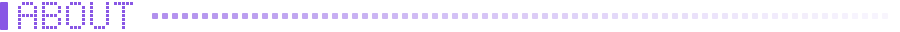</h3>

  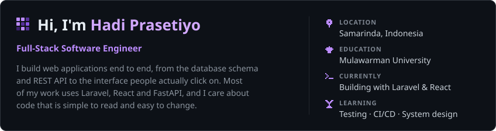

<h3>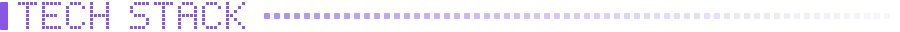</h3>

  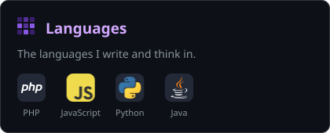
  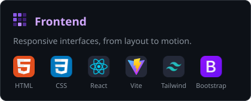
  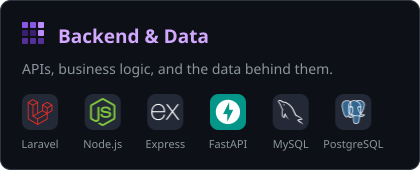
  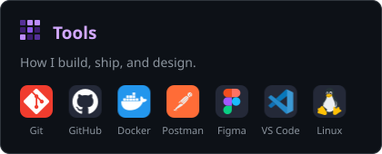

<h3>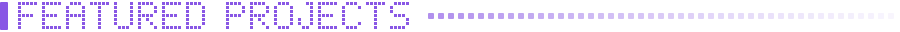</h3>

  <a href="https://github.com/hadiprasetiyo/portfolio-v2">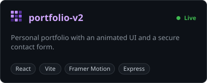</a>
  <a href="https://github.com/hadiprasetiyo/task-tracker">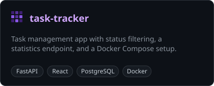</a>
  <a href="https://github.com/hadiprasetiyo/skybarbershop">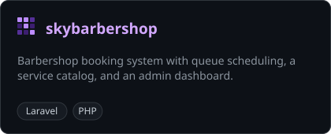</a>
  <a href="https://github.com/hadiprasetiyo/SneaksAvenue">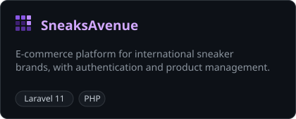</a>

<h3>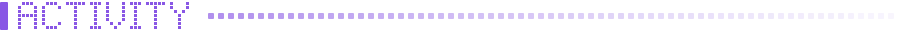</h3>

  <picture>
    <source media="(prefers-color-scheme: dark)" srcset="https://raw.githubusercontent.com/hadiprasetiyo/hadiprasetiyo/output/github-contribution-grid-snake-dark.svg" />
    
  </picture>

 

  

