<p align="center">
  
</p>

<p align="center">
  <a href="https://hadiprasetiyo.my.id"></a>
  <a href="https://linkedin.com/in/hadiprasetiyo/"></a>
  <a href="https://hadiiyok.medium.com"></a>
  <a href="https://instagram.com/hadiiprasetiyo"></a>
</p>

### About

```js
const hadi = {
  role:      "Full-Stack Software Engineer",
  location:  "Samarinda, Indonesia",
  education: "Mulawarman University",
  focus:     ["web applications", "REST APIs", "UI/UX"],
  currently: "building with Laravel, React & FastAPI",
  learning:  ["automated testing", "CI/CD", "system design"],
  funFact:   "I learn fastest by shipping small projects",
};
```

### Tech Stack

<table>
  <tr>
    <td><b>Frontend</b></td>
    <td></td>
  </tr>
  <tr>
    <td><b>Backend</b></td>
    <td></td>
  </tr>
  <tr>
    <td><b>Database</b></td>
    <td></td>
  </tr>
  <tr>
    <td><b>Tools</b></td>
    <td></td>
  </tr>
</table>

### Featured Projects

| Project | What it does | Stack |
| :-- | :-- | :-- |
| **[portfolio-v2](https://github.com/hadiprasetiyo/portfolio-v2)** | Personal portfolio with an animated UI and a secure contact form · [live ↗](https://hadiprasetiyo.my.id) | React · Vite · Framer Motion · Express |
| **[task-tracker](https://github.com/hadiprasetiyo/task-tracker)** | Task management app with status filtering, a statistics endpoint, and a Docker Compose setup | FastAPI · React · PostgreSQL · Docker |
| **[skybarbershop](https://github.com/hadiprasetiyo/skybarbershop)** | Barbershop booking system with queue scheduling, service catalog, and admin dashboard | Laravel · PHP |
| **[SneaksAvenue](https://github.com/hadiprasetiyo/SneaksAvenue)** | E-commerce platform for international sneaker brands, with auth and product management | Laravel 11 · PHP |

<br />

<p align="center">
  <picture>
    <source media="(prefers-color-scheme: dark)" srcset="https://raw.githubusercontent.com/hadiprasetiyo/hadiprasetiyo/output/github-contribution-grid-snake-dark.svg" />
    
  </picture>
</p>
